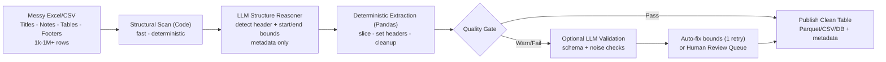
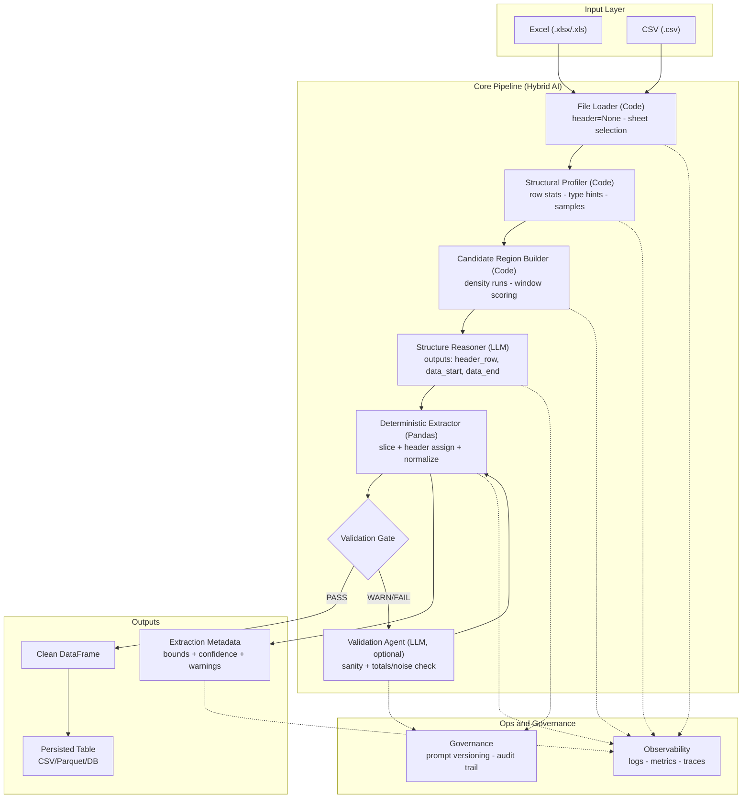
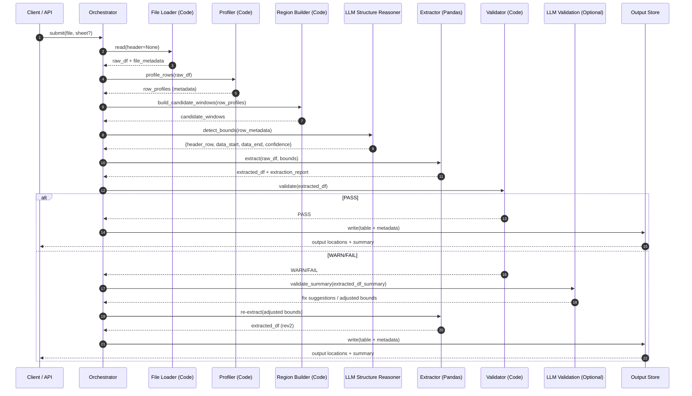
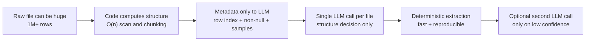
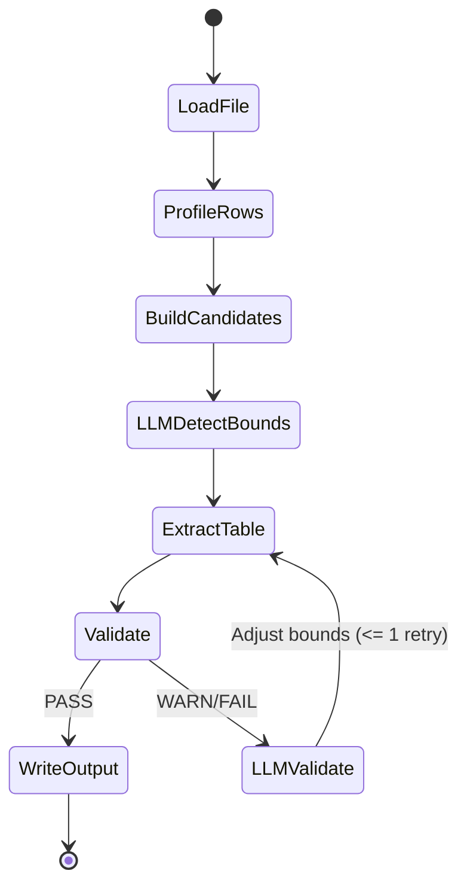
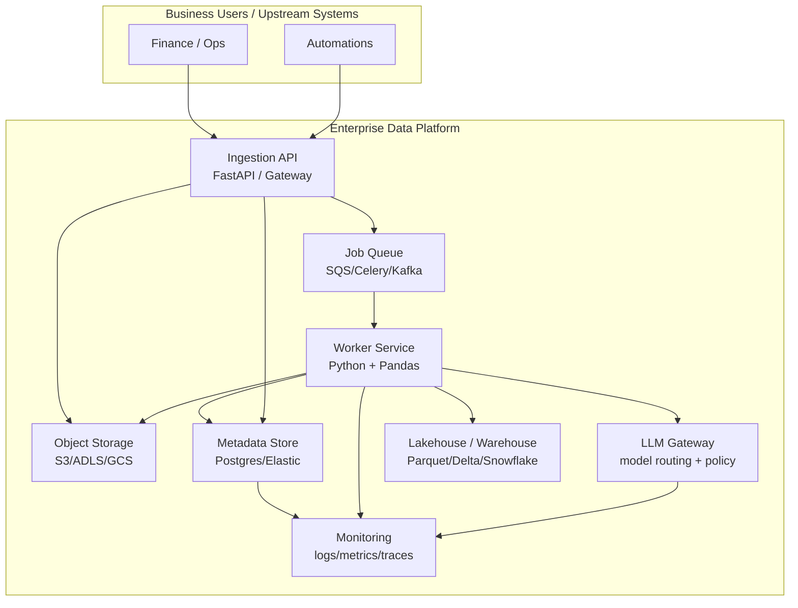

# GenAI Table Extractor — Executive-Ready Mermaid Diagrams

> Copy/paste into a Markdown viewer that supports Mermaid (GitHub, mkdocs-material, etc.)

---

## 1) Executive Overview (Clean, High-Impact)

---

## 2) Component Architecture (Component-by-Component)

---

## 3) Sequence Diagram (What Happens at Runtime)

---

## 4) Executive “Why It Scales” Diagram (Cost + Token Control)

---

## 5) Control Flow (Agentic State Machine)

---

## 6) Deployment (Exec-Friendly Operating Model)

---
End of diagrams.
